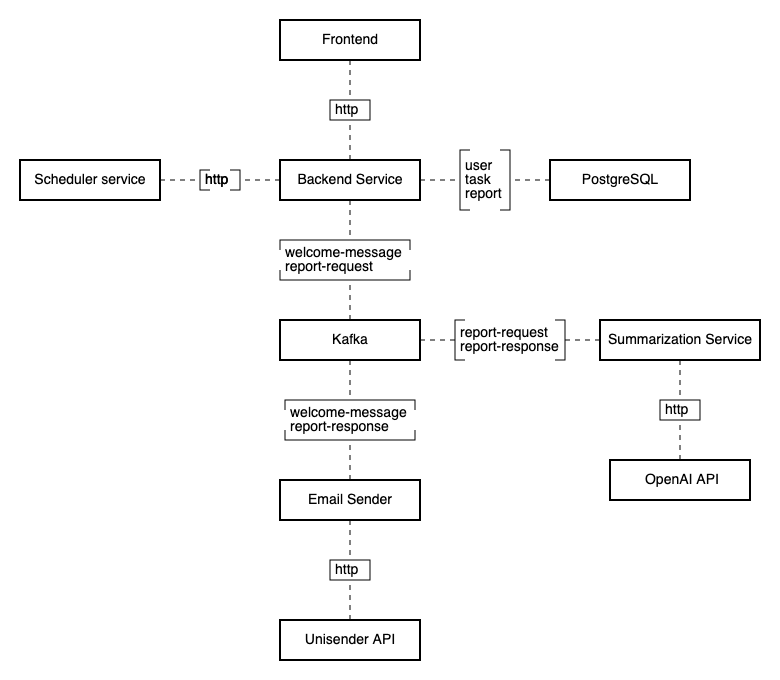
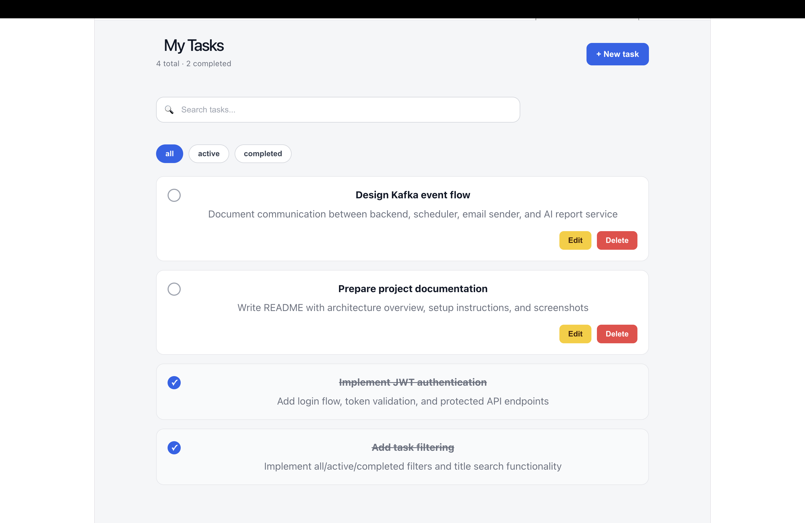
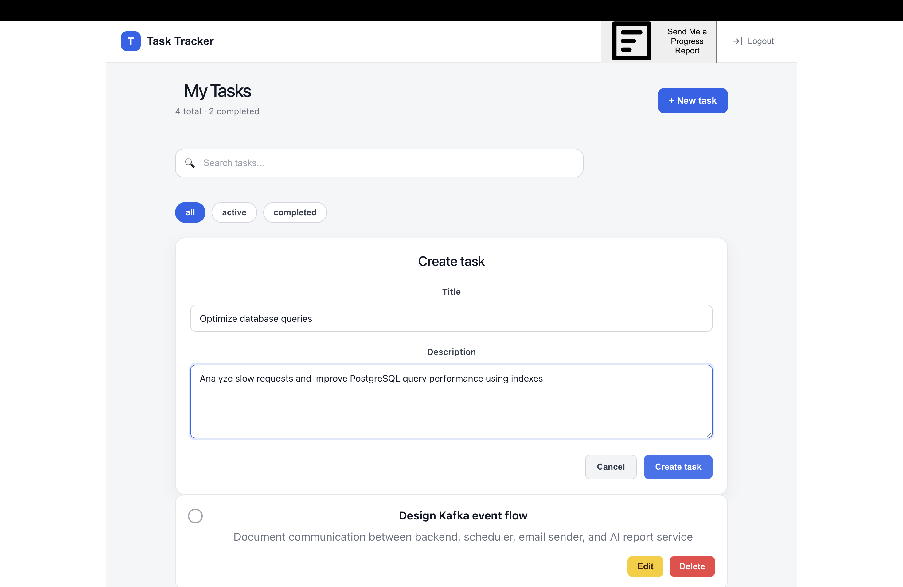
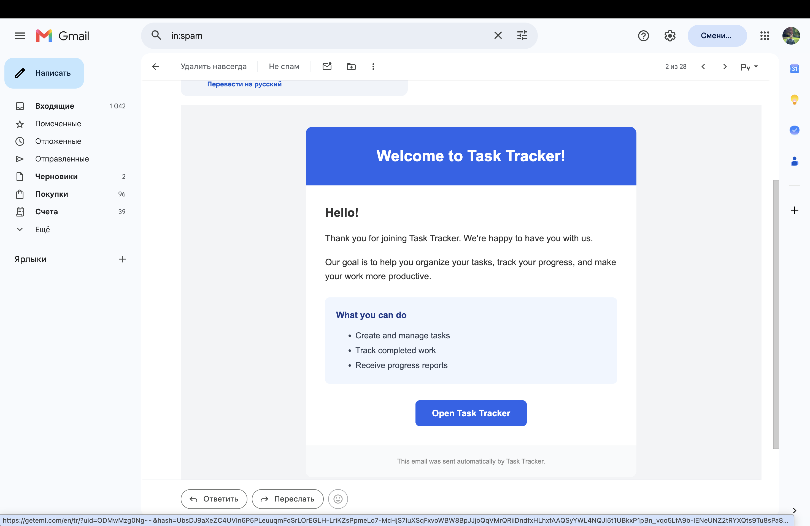
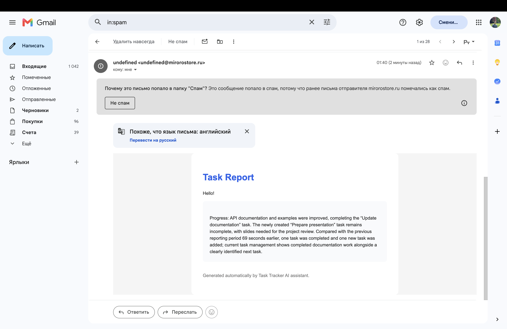
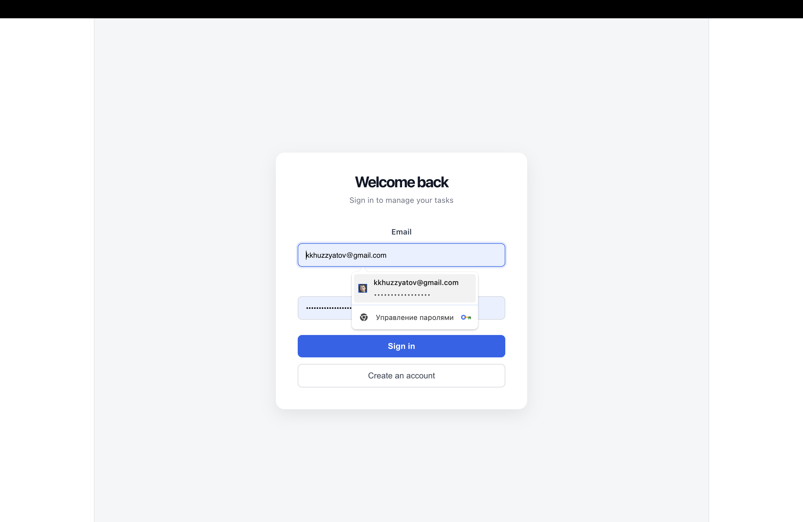
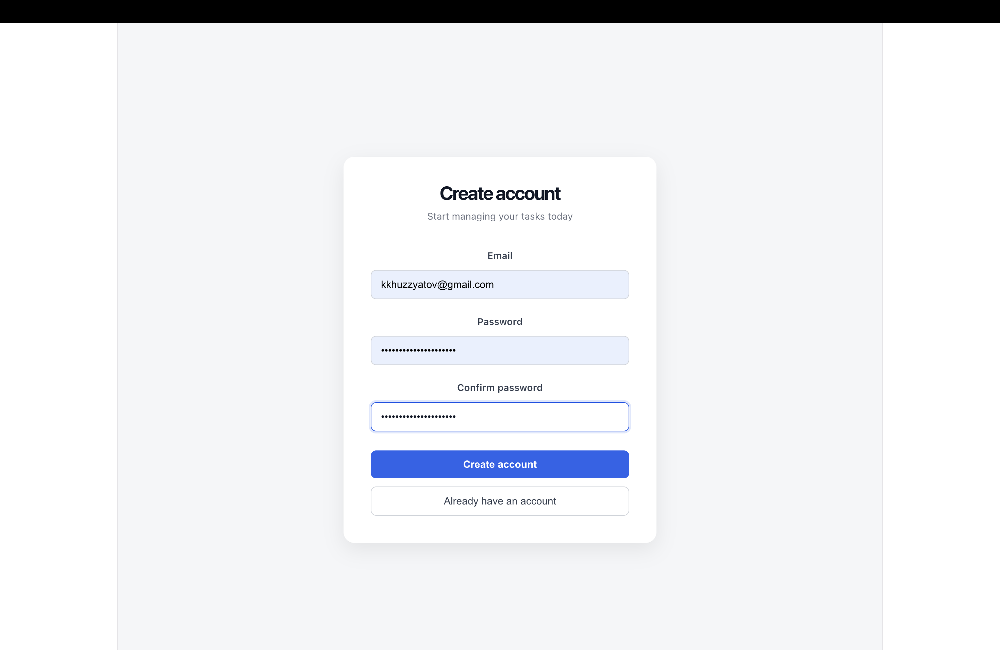

# Task Tracker

A production-oriented task management application built with Java,
Spring Boot, Kafka-based asynchronous communication, AI-powered progress
reports, monitoring, and automated deployment.

The project demonstrates backend engineering practices used in modern
distributed systems: service separation, event-driven architecture,
observability, CI/CD, security, and external API integration.

## Architecture Diagram



## Services Description

The application consists of four independent Java services communicating
through Apache Kafka and http.

| Service | Responsibility |
| --- | --- |
| `task-tracker-backend` | Main REST API. Handles authentication, users, tasks, reports, database access, and produces Kafka events |
| `task-tracker-email-sender` | Consumes email-related Kafka events and sends HTML emails through Unisender |
| `task-tracker-summarization-service` | Generates AI-powered progress reports using OpenAI API |
| `task-tracker-scheduler` | Creates scheduled daily report requests for all users |
## Main Functionality

### User management

-   Account registration
-   Login authentication
-   JWT-based authorization
-   Welcome email after registration

### Task management

Users can: 
- Create tasks 
- Edit tasks 
- Mark tasks as completed 
- Delete tasks

### Progress reports

Users can request personal progress reports manually.

Reports include: 
- List of created tasks 
- List of completed tasks 
- Productivity analysis 
- Comparison with previous reports

### Scheduled reports

The scheduler service automatically requests reports for all users every
day at 00:00.

## Technology Stack

### Backend

-   Java 17
-   Spring Boot
-   Spring Web
-   Spring Cloud
-   Spring Security
-   Spring Data JPA
-   Maven

### Messaging

-   Apache Kafka

### Database

-   PostgreSQL
-   Liquibase

### Infrastructure

-   Docker
-   Docker Compose
-   GitHub Actions

### Monitoring and logging

-   Prometheus
-   Grafana
-   Loki

### External services

-   OpenAI API
-   Unisender API

## Engineering Highlights

### Event-driven architecture

Kafka is used for asynchronous communication between services.

Implemented flows: 
- Welcome email notifications
- AI report generation pipeline

### Structured logging and observability

Implemented: 
- Structured application logs 
- Loki log aggregation 
- Grafana dashboards 
- Prometheus JVM metrics

### CI/CD Pipeline

GitHub Actions are used for automated quality checks and deployment.

Checks: 
- Spotless formatting validation 
- SpotBugs static analysis

Deployment: 
1. Build Maven applications 
2. Build Docker images 
3. Push images to Docker registry 
4. Deploy updated containers

### Containerized deployment

Docker Compose includes: 
- Application services 
- PostgreSQL 
- Kafka
- Prometheus 
- Grafana 
- Loki

### Automated build process

The `build.sh` script: 
1. Builds all Maven services 
2. Removes previous containers 
3. Starts the Docker Compose environment

## Security

Implemented: 
- JWT authentication 
- Password hashing 
- Protected API endpoints 
- Internal service authentication using API keys 
- CORS configuration

## Running Locally

### Requirements

-   Docker
-   Docker Compose
-   Java 17
-   Maven

### Configuration

Create environment configuration:

``` bash
cp .env.example .env
```

Update required variables:

``` env
POSTGRES_USER=
POSTGRES_PASSWORD=
JWT_SECRET=
INTERNAL_API_KEY=
OPENAI_BASE_URL=
OPENAI_API_KEY=
OPENAI_MODEL=
UNISENDER_API_KEY=
APP_URL=
APP_FRONTEND_URL=
```

### Start application

Using the build script:

``` bash
./build.sh
```

### Available services

Frontend:

    http://localhost:5173

Backend API:

    http://localhost:8080

Grafana:

    http://localhost:3000

## Demo / Screenshots

### Application overview




### AI Progress Report




### Authentication



